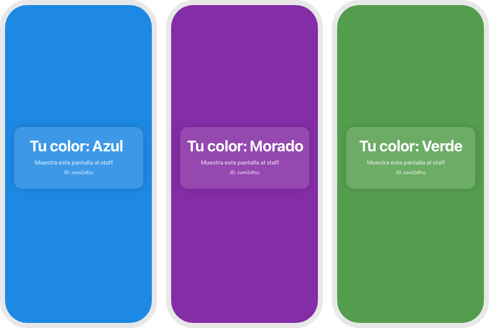

# Team Assignment Web App

A dynamic team management system that automatically assigns users to color-coded teams using a beautiful web interface powered by Google Sheets and Apps Script.



## 🌟 Features

- **Automatic Team Assignment** - Users get assigned to balanced color-coded teams
- **Beautiful UI** - Glassmorphism design with dynamic color theming
- **Persistent Assignments** - Same user always gets the same color
- **Load Balancing** - New users automatically fill the smallest teams
- **Staff Verification** - Visual color confirmation screen for event staff
- **Team Redistribution** - Admin can shuffle all teams with one click
- **Mobile Responsive** - Works perfectly on phones, tablets, and desktops
- **Real-time Data** - Powered by live Google Sheets integration

## 🎯 Use Cases

Perfect for:
- **Workshops & Conferences** - Assign attendees to breakout groups
- **Team Building Events** - Create random teams for activities
- **Educational Settings** - Organize students into project groups
- **Sports Events** - Assign participants to competing teams
- **Social Events** - Mix people into conversation groups

## 🚀 Quick Start

### 1. Set Up Google Sheets

1. Create a new Google Spreadsheet
2. Create two sheets:
   - **"Configuracion"** - For team settings
   - **"Personas"** - For storing people assignments

#### Configuracion Sheet Setup:
```
A1: num_equipos    B1: (leave empty)
A2: colores        B2: 4
A3:                B3: Rojo,Azul,Verde,Amarillo
```

#### Personas Sheet Setup:
```
A1: ID    B1: Nombre    C1: Color
(Data will be populated automatically)
```

### 2. Deploy Google Apps Script

1. In your Google Sheet, go to **Extensions > Apps Script**
2. Replace the default code with the provided Apps Script code
3. Save the project (give it a name like "Team Assignment API")
4. Click **Deploy > New Deployment**
5. Choose **Web app** as the type
6. Set execute as **Me** and access to **Anyone**
7. Click **Deploy** and copy the web app URL

### 3. Deploy Web App

1. Update the `apiUrl` variable in the HTML file with your Apps Script URL
2. Upload the HTML file to your hosting platform (GitHub Pages, Netlify, etc.)

## 📋 Configuration

### Team Colors
Edit cell B3 in the "Configuracion" sheet with comma-separated colors:
```
Rojo,Azul,Verde,Amarillo,Naranja,Morado,Gris
```

### Number of Teams
Edit cell B2 in the "Configuracion" sheet with the desired number of teams:
```
4
```

**Note:** Make sure you have at least as many colors as teams!

## 🎨 Supported Colors

The app includes built-in styling for these colors:
- **Rojo** (Red) - `#e53935`
- **Azul** (Blue) - `#1e88e5`  
- **Verde** (Green) - `#43a047`
- **Amarillo** (Yellow) - `#fdd835`
- **Naranja** (Orange) - `#fb8c00`
- **Morado** (Purple) - `#8e24aa`
- **Gris** (Gray) - `#9e9e9e`

## 🔧 API Endpoints

The Apps Script provides these API actions:

### Get Team Configuration
```
GET ?action=getConfig
Returns: {num_equipos: 4, colores: ["Rojo", "Azul", ...]}
```

### Assign Color to User
```
GET ?action=assignColor&id=user123&nombre=John
Returns: {id: "user123", nombre: "John", color: "Rojo"}
```

### Get User Assignment
```
GET ?action=getPersona&id=user123  
Returns: {id: "user123", nombre: "John", color: "Rojo"}
```

### Get All People
```
GET ?action=getPersonas
Returns: [{id: "user123", nombre: "John", color: "Rojo"}, ...]
```

### Manual Add Person
```
GET ?action=addPersona&id=user123&nombre=John&color=Rojo
Returns: {status: "ok"}
```

## 🔄 Team Management

### Automatic Assignment
- New users are automatically assigned to the team with the fewest members
- Assignments are persistent - same user always gets the same color
- Load balancing ensures even team distribution

### Manual Redistribution
Run the `redistribuirEquipos()` function in Apps Script to:
- Shuffle all existing people randomly
- Redistribute them evenly across all teams
- Create completely new team combinations

## 🎯 User Experience

1. **User visits the web app**
   - Sees "Asignando…" loading screen
   - App generates unique user ID (stored in browser)

2. **Team assignment happens**
   - Checks if user already has a color assigned
   - If not, assigns them to the most balanced team
   - Stores assignment in Google Sheets

3. **Color confirmation screen**
   - Entire page changes to team color
   - Shows "Tu color: [Color Name]"
   - Displays "Muestra esta pantalla al staff"
   - Shows user ID for staff verification

## 🛠 Technical Details

### Frontend
- **HTML5** with modern CSS (glassmorphism, backdrop-filter)
- **Vanilla JavaScript** (no dependencies)
- **Responsive design** with clamp() functions
- **Automatic color contrast** calculation for accessibility

### Backend  
- **Google Apps Script** for serverless API
- **Google Sheets** as database
- **Fisher-Yates shuffle** for randomization
- **Round-robin assignment** for load balancing

### Browser Support
- Chrome 76+ (backdrop-filter support)
- Firefox 103+
- Safari 18+
- Mobile browsers (iOS Safari, Chrome Mobile)

## 🔒 Privacy & Data

- **No personal information required** - uses anonymous user IDs
- **Data stored in your Google Sheet** - you control all data
- **Local browser storage** for user ID persistence
- **No external tracking** or analytics

## 🐛 Troubleshooting

### Common Issues

**"Error: No se pudo obtener el color"**
- Check that your Apps Script is deployed as a web app
- Verify the API URL is correct in the HTML
- Ensure Google Sheets has proper permissions

**Teams are unbalanced**
- Run `redistribuirEquipos()` to rebalance
- Check that num_equipos ≤ number of colors

**Colors not displaying correctly**
- Verify color names match exactly (case-sensitive)
- Ensure B3 cell has comma-separated values with no extra spaces

### Apps Script Permissions
When first running, you'll need to authorize the script to:
- Read and edit your Google Sheets
- Serve content as a web app

## 📄 License

This project is open source and available under the [MIT License](LICENSE).

## 🤝 Contributing

Feel free to:
- Report bugs by opening an issue
- Suggest new features
- Submit pull requests with improvements
- Share your use cases and feedback

## 📞 Support

Need help? Check the troubleshooting section above or open an issue describing:
- What you expected to happen
- What actually happened  
- Steps to reproduce the problem
- Screenshots if applicable

---

Made with ❤️ for better team organization and event management.
